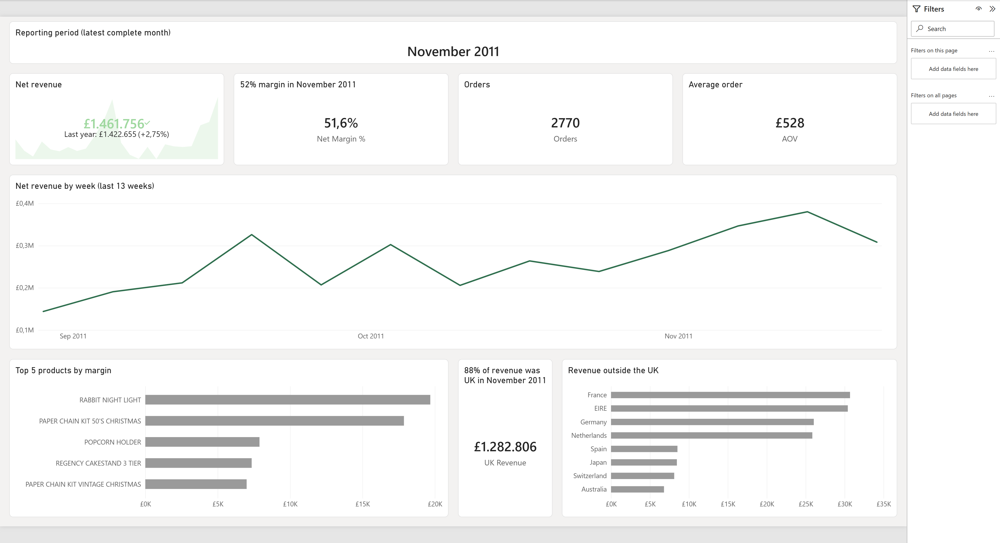
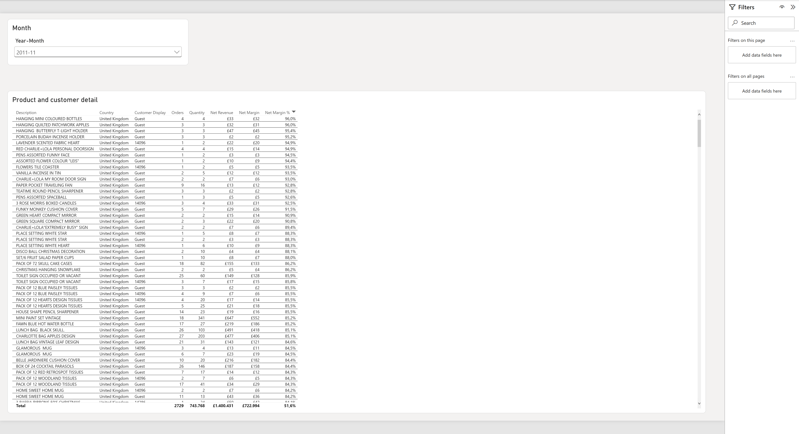
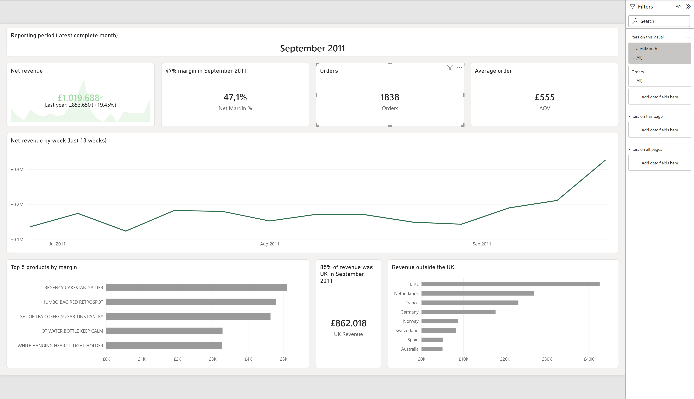

# Retail analytics report

It's Monday morning, and the owner of an online gift shop wants three things before coffee: how last month went, whether margin held up, and what's selling. Not a spreadsheet to dig through — one screen, already scoped to the month that just closed.



That's built on the [Online Retail II](https://archive.ics.uci.edu/dataset/502/online+retail+ii) dataset — about a million rows of real (and messy) transaction-level exports from a UK-based online retailer — cleaned up and modeled properly, not just charted as-is. A second page lets you drill into any product or customer behind those numbers:



I built this as a portfolio piece to show the whole path, not just the finished report: the data-quality issues I found in the raw export, the decisions I made about each one and why, and the model and report built on top of those decisions.

## How it's put together

```
data/online_retail_II.xlsx           the source: two overlapping yearly sheets, ~1M rows
        │
        ▼
explore_retail.ipynb                 exploration — every data-quality issue, what I did
        │                            about it and why (→ analysis_report.md)
        ▼
power_query_cleaning_guide.md        those decisions written up as exact Power Query steps
        │
        ▼
split_into_monthly_raw.py            splits the source into one CSV per month, so it lands
        │                            in data/raw/ the way a client export actually would
        ▼
generate_product_costs.py            builds a synthetic supplier-cost table (there's no real
        │                            cost data in this dataset) for margin analysis
        ▼
reports/RetailDemo.pbip              the Power BI model and report
```

## What's in the repo

| Path | What it is |
|---|---|
| `explore_retail.ipynb` | The exploration notebook — where I worked through the data-quality issues and decided what to do about each one. Produces the numbers behind `analysis_report.md`. |
| `reports/analysis_report.md` | Write-up of the findings: every issue, the decision, the reasoning. |
| `power_query_cleaning_guide.md` | Each of those decisions turned into the exact Power Query M steps used to build the model. |
| `split_into_monthly_raw.py` | Splits the historical workbook into monthly CSVs so the project has something to point Power Query at. Run once to set up the data folder. |
| `generate_product_costs.py` | Generates a synthetic cost-per-unit table, since the source dataset has no real cost data. Deliberately doesn't cover every product — the model reports on that gap separately rather than pretending it doesn't exist. |
| `analyze_retail.py` | An earlier, superseded exploration pass, kept for history. `explore_retail.ipynb` replaced it. |
| `reports/RetailDemo.pbip`, `reports/RetailDemo.Report/`, `reports/RetailDemo.SemanticModel/` | The Power BI project, saved in the [PBIP format](https://learn.microsoft.com/power-bi/developer/projects/projects-overview) so the model and report definitions are plain diffable JSON/TMDL rather than a binary file. Star schema (`fact_sales` plus `dim_product`, `dim_customer`, `dim_date`, `dim_country`, `dim_product_cost`), DAX measures for revenue/COGS/margin/time-intelligence, and two report pages — a summary page scoped to the latest complete month, and a drillthrough detail page. Open `RetailDemo.pbip` in Power BI Desktop. |
| `data/`, `archive/` | Local only, not in git — the source workbook and the monthly CSVs it's split into. |

## Proving the refresh

The claim that matters isn't "it refreshes" — it's that a new month of data doesn't require rebuilding anything. I tested that directly rather than just asserting it.

**Before** — `data/raw/` held 22 months, through September 2011:



I dropped two more months (`2011-10`, `2011-11`) into `data/raw/` and hit Refresh in Power BI Desktop. No measures edited, no Power Query steps touched.

**After** — same report, same file, one refresh:


What moved on its own: the reporting period flipped from September to November, all four summary cards recalculated off the new latest month, the 13-week trend window slid forward to match, and the top-products and country charts reflect November's mix (seasonal stock — Christmas items — moves straight into the top 5). `dim_date` extended to cover the new rows without any manual step. That's the actual engineering point: the model reads "latest month" from the data itself, so a new export is a data event, not a rebuild.

## How this deploys in a client tenant

Locally, "refresh" means opening Power BI Desktop and clicking the button — which is what the screenshots above show. In a real client setup, that step disappears:

1. The client's monthly export lands in a SharePoint document library or OneDrive for Business folder — the same shape as `data/raw/`, just cloud-hosted instead of local.
2. The dataset is published to a workspace in the client's Power BI tenant, pointed at that folder.
3. Scheduled refresh is turned on in the Service — up to 8 times a day on a Pro license, more with Premium/Fabric capacity.
4. **No on-premises gateway required.** A gateway is only needed to reach a data source sitting inside a private network; SharePoint and OneDrive are already cloud-native, so the Service can refresh straight from them.

One honest note: this repo runs the refresh locally rather than on that pipeline because Power BI Service needs a Microsoft work or school account, which a portfolio project doesn't have — a client tenant does.

## Running it locally

```powershell
python -m venv .venv
.venv\Scripts\pip install -r requirements.txt
# place the source workbook at data/online_retail_II.xlsx (not included in this repo)
.venv\Scripts\python split_into_monthly_raw.py
.venv\Scripts\python generate_product_costs.py
.venv\Scripts\jupyter nbconvert --to notebook --execute --inplace explore_retail.ipynb
```

Then open `reports/RetailDemo.pbip` in Power BI Desktop.
